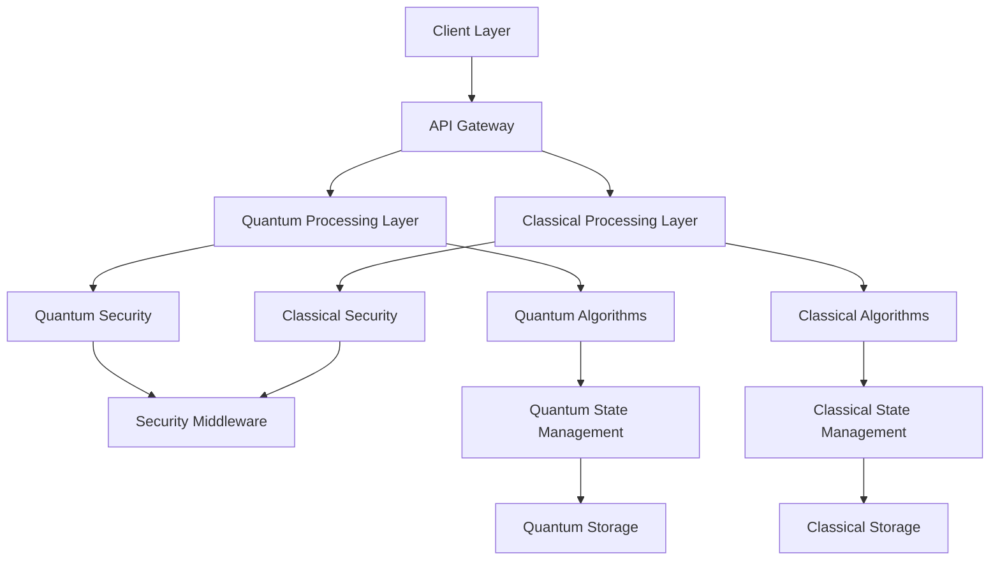
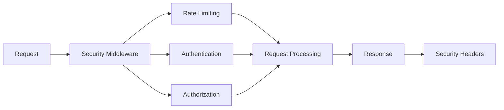
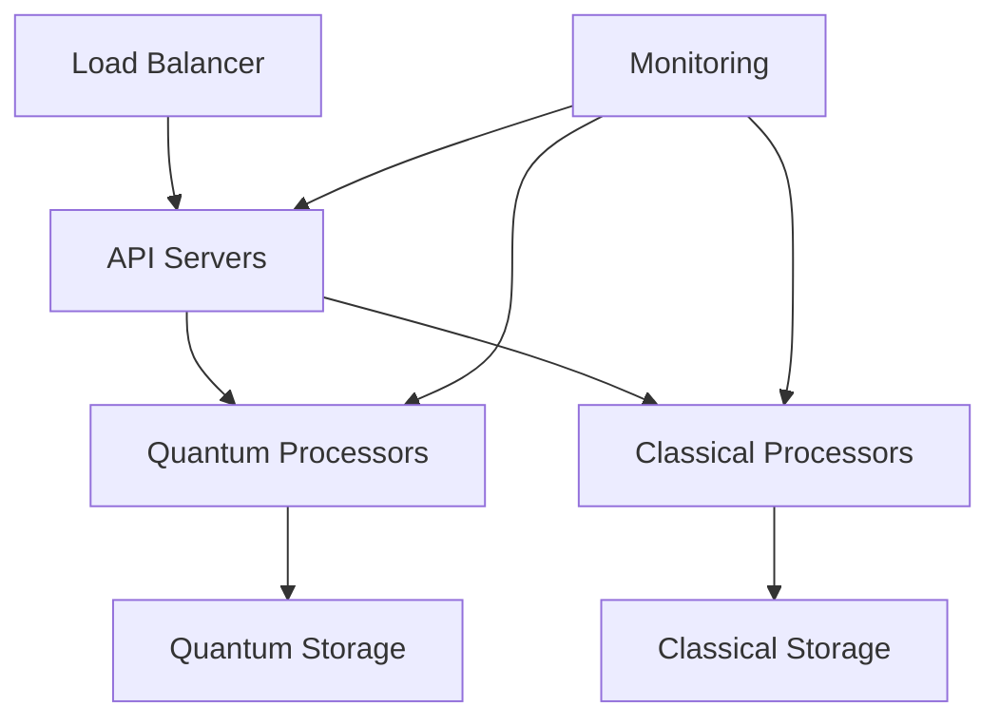

# Entangled Multimodal System Architecture

## System Overview

The Entangled Multimodal System is a quantum-classical hybrid framework that integrates multiple modalities (text, audio, visual) with quantum computing capabilities. The system is designed to be scalable, secure, and maintainable.

## Architecture Diagram

## Component Details

### 1. Client Layer
- Web interface for user interaction
- API clients for system integration
- Real-time monitoring dashboard

### 2. API Gateway
- Request routing and load balancing
- Authentication and authorization
- Rate limiting and security policies

### 3. Quantum Processing Layer
- Quantum algorithm execution
- Quantum state management
- Error correction and mitigation

### 4. Classical Processing Layer
- Traditional algorithm execution
- Data preprocessing and postprocessing
- State management and caching

### 5. Security Layer
- Quantum-resistant encryption
- Secure session management
- Audit logging and monitoring

### 6. Storage Layer
- Quantum state persistence
- Classical data storage
- Cache management

## Security Architecture

## Data Flow

1. **Request Processing**
   - Client sends request to API Gateway
   - Security middleware validates request
   - Request is routed to appropriate processing layer

2. **Quantum Processing**
   - Quantum state initialization
   - Algorithm execution
   - Error correction
   - Measurement and result processing

3. **Classical Processing**
   - Data preprocessing
   - Algorithm execution
   - Result postprocessing
   - Response generation

4. **Response Handling**
   - Security headers added
   - Response returned to client
   - Audit logging

## Security Considerations

1. **Quantum Security**
   - Post-quantum cryptography
   - Quantum key distribution
   - Quantum-resistant signatures

2. **Classical Security**
   - TLS 1.3 encryption
   - Secure session management
   - Rate limiting
   - Input validation

3. **Monitoring and Logging**
   - Security event logging
   - Performance monitoring
   - Error tracking

## Performance Considerations

1. **Quantum Processing**
   - Error mitigation strategies
   - State management optimization
   - Parallel processing

2. **Classical Processing**
   - Caching strategies
   - Load balancing
   - Resource optimization

## Deployment Architecture

## Future Considerations

1. **Scalability**
   - Horizontal scaling of quantum processors
   - Distributed quantum computing
   - Cloud integration

2. **Security**
   - Advanced quantum cryptography
   - Zero-trust architecture
   - Continuous security monitoring

3. **Performance**
   - Quantum error correction improvements
   - Classical processing optimization
   - Caching strategies enhancement 